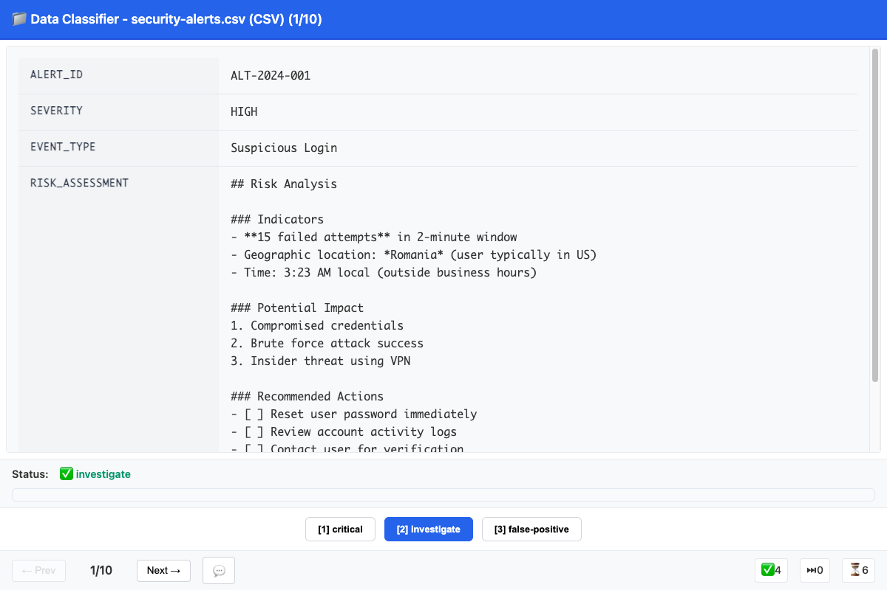
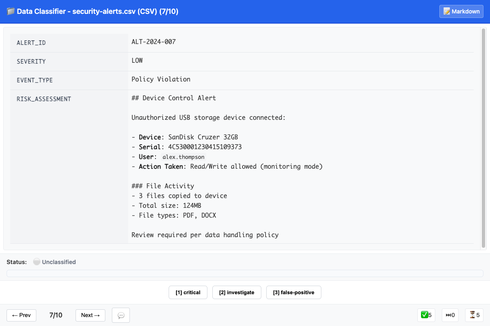
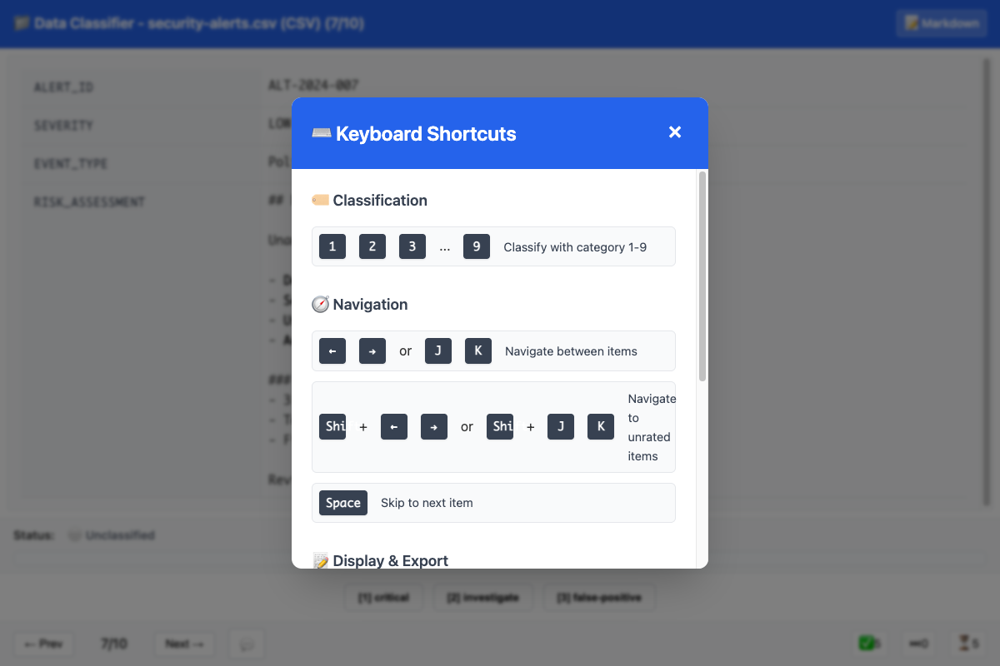

# File Classifier

A fast, lightweight CLI tool for macOS and Linux that launches a simple web interface for manually classifying files or CSV rows.  
Built with Bun, TypeScript, and vanilla web technologies for maximum performance and simplicity.

## Why?

When working with a collection of files—or rows of data in a CSV—it’s often
necessary to review and categorize each item.  Doing this in a spreadsheet or
directly on the command line can be inconvenient, particularly when fields
contain long text, markdown, or other formatting that’s easier to read in a
browser.

## What It Does

`file-classifier` provides a streamlined workflow:

1. Run the CLI command.
2. A small web UI opens instantly in your browser.
3. Review files or CSV rows quickly in a clean, readable format.
4. Apply labels, categories, or notes with minimal friction.

The goal is **speed and simplicity**: an interface that gets out of your way so you can focus on classification, not tooling.



## Features

- 🚀 **Blazing Fast**: Built with Bun runtime, starts in milliseconds
- 📱 **Responsive Web UI**: Clean, keyboard-driven interface
- 💾 **Auto-Save**: Classifications persist automatically across sessions
- 🔧 **Configurable Categories**: Support for 1-9 custom categories
- 📄 **Multiple Formats**: Works with text files and CSV data
- ⌨️ **Rich Keyboard Shortcuts**: Navigation, classification, comments, and help
- 📝 **Markdown Rendering**: Toggle markdown display mode (Cmd+M)
- 💬 **Comments System**: Add notes to items with keyboard shortcuts (M key)
- 🎯 **Zero Dependencies**: Self-contained ~60MB binaries
- 🔄 **Session Resume**: Automatically restores previous work
- 🔍 **CSV Column Selection**: Focus on specific columns with --columns

## Installation

### Quick Install from Source

If you have Bun installed, you can use the automated install script that detects your platform and builds the appropriate binary:

```bash
# Clone the repository
git clone https://github.com/thejud/file-classifier.git
cd file-classifier

# Install to ~/.local/bin (no sudo required)
INSTALL_DIR=~/.local/bin bun run install:local

# Or install to /usr/local/bin (requires sudo)
sudo bun run install:local

# Uninstall
bun run uninstall:local
```

The install script:
- Auto-detects your OS (macOS/Linux) and architecture (x64/ARM64)
- Builds the correct binary for your platform
- Handles permissions and PATH configuration
- Supports custom installation directories with `--dir`

### Pre-built Binaries

Download the appropriate binary from the [releases page](https://github.com/thejud/file-classifier/releases):

#### macOS
- **Apple Silicon (M1/M2/M3)**: `file-classifier-macos-arm64`
- **Intel Macs**: `file-classifier-macos-intel`

```bash
# Download and install (example for Apple Silicon)
chmod +x file-classifier-macos-arm64
sudo mv file-classifier-macos-arm64 /usr/local/bin/file-classifier
```

#### Linux
- **Linux x64**: `file-classifier-linux-x64`
- **Linux ARM64**: `file-classifier-linux-arm64`

```bash
# Download and install (example for x64)
chmod +x file-classifier-linux-x64
sudo mv file-classifier-linux-x64 /usr/local/bin/file-classifier
```

**Note**: All binaries are fully standalone and don't require Bun or Node.js on the target system.

## Quick Start

### File Mode (Default)
Classify text files line by line:
```bash
file-classifier document.txt report.txt
```

### CSV Mode
Classify CSV rows as individual items:
```bash
file-classifier --csv data.csv
```

### Column Selection (CSV Mode)
Show only specific columns from CSV files:
```bash
file-classifier --csv --columns "title,content,priority" data.csv
```

### Categories

By default, the classifier uses three categories: **good** (1), **bad** (2), and **review** (3). The keyboard shortcuts correspond to the order you specify, not alphabetical order.

#### Custom Categories
Define your own classification categories:
```bash
file-classifier --categories "urgent,normal,low" emails.txt
file-classifier --csv --categories "spam,ham,unsure" messages.csv
```

## Usage

```
Usage: file-classifier [options] <files...>

Options:
  --csv, -c                        CSV mode (otherwise file mode)
  --categories "cat1,cat2"         Custom categories (comma-separated, 1-9 max)
  --columns "col1,col2"            CSV column subset (default: all columns)
  --port <number>                  Specific port (default: random)
  --no-browser                     Don't auto-launch browser
  --reset                          Clear previous classifications and comments for specified files

Examples:
  file-classifier file1.txt file2.txt
  file-classifier --csv data.csv
  file-classifier --csv --columns "Detection Name,uuid,message" data.csv
  file-classifier --categories "spam,ham,unsure" *.txt
  file-classifier -c "bug,feature,question" --csv data.csv
  file-classifier --reset file1.txt file2.txt
```

## Data Management

### Clearing Classifications

To clear previous classifications and comments for specific files:

```bash
# Clear classification data for specific files
file-classifier --reset file1.txt file2.txt

# Clear CSV data classifications
file-classifier --reset --csv data.csv

# Clear with specific categories (must match original session)
file-classifier --reset --categories "spam,ham,unsure" *.txt
```

Classification data is stored in `~/.config/file-classifier/` as session files (following XDG Base Directory Specification). Each unique combination of files, categories, and mode creates a separate session. The `--reset` option only clears data for the exact session that matches your specified files and options, leaving other sessions intact.

## Keyboard Shortcuts

### Classification
- **1-9**: Classify current item with category 1-9

### Navigation
- **←/→** or **J/K**: Navigate between items (or click Prev/Next)
- **Shift+←/→** or **Shift+J/K**: Navigate to unrated items only
- **Space**: Skip to next item without classifying

### Display & Export
- **Cmd+M** (or Ctrl+M): Toggle markdown rendering mode
- **Cmd+E** (or Ctrl+E): Export results to JSON file
- **M**: Add/edit comment for current item
- **Shift+Enter**: Save comment (when in comment modal)

### Help
- **?** or **/**: Show/hide keyboard shortcut help
- **Escape**: Close any open modal

## Screenshots

### Security Alert Review Example
The classifier excels at reviewing security alerts and incidents with rich markdown formatting:


*Reviewing a suspicious login alert with markdown-formatted risk assessment*

### Markdown Rendering
Toggle between raw and rendered markdown views for better readability:


*Markdown rendering mode shows formatted content with proper styling*

### Keyboard Shortcuts
Comprehensive keyboard shortcuts for efficient classification:


*Press `?` to view all available keyboard shortcuts*

## Web Interface

The tool provides a clean, keyboard-driven interface optimized for rapid classification:

## Session Management

Classifications are automatically saved and restored when you restart with the same files and categories. This allows you to:

- Stop and resume work anytime
- Refresh the browser without losing progress
- Recover from crashes or interruptions

## Export & Results

Results are exported as JSON with this structure:

```json
{
  "sessionId": "session-1234567890",
  "config": {
    "mode": "csv",
    "categories": ["spam", "ham", "unsure"],
    "sources": ["messages.csv"]
  },
  "classifications": [
    {
      "itemId": "messages.csv:row:1",
      "category": 2,
      "categoryName": "ham",
      "timestamp": "2024-01-15T10:30:00.000Z"
    }
  ],
  "summary": {
    "totalItems": 100,
    "classifiedItems": 75,
    "unclassifiedItems": 25,
    "categoryCounts": {
      "spam": 20,
      "ham": 50,
      "unsure": 5
    }
  },
  "exportedAt": "2024-01-15T11:00:00.000Z"
}
```

## File Formats

### Text Files
- Each file is treated as one classification item
- Displayed with syntax highlighting and line numbers
- Supports any text-based format (.txt, .md, .log, etc.)

### CSV Files
- Each row becomes a classification item
- Displayed as key-value pairs for easy reading
- Automatic parsing with quote handling
- Header row used for column names

## Development

Built with modern web technologies:

- **Runtime**: Bun (blazing fast JavaScript runtime)
- **Language**: TypeScript (type safety)
- **Frontend**: Vanilla HTML/CSS/JS (no framework bloat)
- **Testing**: Bun test + Playwright E2E
- **Packaging**: Single executable binaries

### Building from Source

```bash
# Clone and install dependencies
git clone <repository>
cd file-classifier
bun install
```

### Running from Source (Development)

For **Apple Silicon Macs** (M1/M2/M3) - most common:
```bash
# Run directly with TypeScript files
bun src/index.ts file1.txt file2.txt
bun src/index.ts --csv data.csv
bun src/index.ts --categories "spam,ham,unsure" --csv messages.csv
```

For **Intel Macs**:
```bash
# Same commands work
bun src/index.ts --csv --columns "title,content" data.csv
```

### Alternative Development Commands
```bash
# Using the dev script (opens with sample data)
bun run dev file.txt

# Run tests
bun run test        # Unit tests only (*.test.ts)
bun run test:e2e    # E2E tests with Playwright (*.spec.ts)
bun run test:all    # Run both test suites

# Note: Use 'bun run test' instead of 'bun test' directly
# 'bun test' auto-discovers all files including E2E tests which require Playwright

# Build standalone binaries for macOS
bun run build        # Apple Silicon (ARM64)
bun run build:intel  # Intel Mac

# Cross-compile for Linux (from macOS)
bun build --compile --target=bun-linux-x64 src/cli.ts --outfile=file-classifier-linux
bun build --compile --target=bun-linux-arm64 src/cli.ts --outfile=file-classifier-linux-arm64

# Cross-compile with optimizations
bun build --compile --target=bun-linux-x64 --minify --bytecode src/cli.ts --outfile=file-classifier-linux
```

## Use Cases

- **Email Classification**: Sort emails into spam/ham/unsure
- **Document Triage**: Categorize documents by priority/topic
- **Content Moderation**: Review and classify user-generated content
- **Data Labeling**: Create training datasets for ML models
- **Bug Triage**: Classify bug reports by severity/type
- **Research Data**: Categorize survey responses or research data

## Performance

- **Startup Time**: < 100ms
- **Memory Usage**: ~20MB base + data size
- **File Handling**: Tested with files up to 10MB
- **Browser Compatibility**: Modern browsers (Chrome, Safari, Firefox)
- **Keyboard Responsiveness**: Sub-100ms classification

## Requirements

- **Operating System**:
  - macOS 10.15+ (Catalina or newer)
  - Linux (x64 or ARM64)
- **Architecture**: Intel x64 or ARM64
- **Browser**: Any modern browser for the web interface
- **Disk Space**: 100MB for binaries + session storage


## Support

- Report issues: [GitHub Issues]
- Documentation: This README
- Examples: See `tests/fixtures/` for sample data formats

---

**Built with ❤️ for rapid manual data classification**
